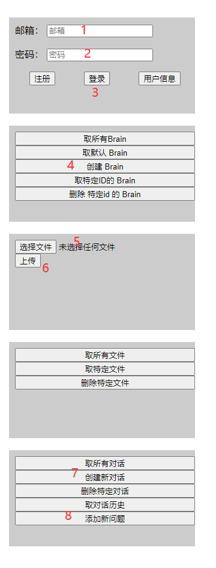

- [Quivr 前端 实验](#quivr-前端-实验)
  - [1. 部署](#1-部署)
    - [1.1. 安装](#11-安装)
    - [1.2. 运行](#12-运行)
  - [2. HTTP API](#2-http-api)
    - [2.1. app.ts](#21-appts)
    - [2.2. user.ts](#22-userts)
    - [2.3. brain.ts](#23-braints)
    - [2.4. file.ts](#24-filets)
    - [2.5. chat.ts](#25-chatts)
    - [2.6. `TODO` crawl.ts](#26-todo-crawlts)

# Quivr 前端 实验

## 1. 部署

+ Quivr 版本：本文档 API 对应的 Quivr 版本为 v0.0.34
+ Node.js: TLS 稳定版本 (本人 用的 v18.16.0)

### 1.1. 安装

``` bash

npm install

```

### 1.2. 运行

运行前，请修改 src/setting.ts 的 三个变量：

|变量名|作用|
|--|--|
|`QUIVR_SERVER_URL`|Quivr 服务器|
|`SUPABASE_URL`|Supabase 服务器，用于 注册/登录|
|`SUPABASE_ANON_KEY`|Quivr，用于 创建 Supabase 客户端|

构建 & 监听 服务器：

``` bash
npm run start
```

浏览器启动: http://localhost:1234

所有的按钮运行结果，都在控制台中，请按 F12 控制台查看

注意：（以后可以自己摸索，因为有些顺序关联，所以）第一次运行的时候，操作顺序依次是：

+ 邮箱，密码
+ 登录 按钮
+ 创建 Brain
+ 选择文件 并 上传（尽量上传一个小文件）
+ 创建新对话
+ 添加新问题（问题写死在 src/chat.ts 中：“你现在有哪些文章？”）
+ 取对话历史



## 2. HTTP API

所有 API 参数 和 返回值 看 对应的 ts 文件

### 2.1. app.ts

主要是 调用 dom 元素的 监听，和 每个 src/*.ts 连起来；

|API|方法|作用|
|--|--|--|
|/|GET|查看服务器状态|

### 2.2. user.ts

+ supabase 注册
+ supabase 登录
    - 登陆完毕，拿到 access_token, 保存起来，供下次 自动登录；

|API|方法|作用|
|--|--|--|
|/user|GET|取用户信息|

### 2.3. brain.ts

|API|方法|作用|
|--|--|--|
|/brains|GET|大脑|
|/brains/default/|GET|默认大脑，第一次登录后，自动创建|
|brains/{brain_id}|GET|取id指定的大脑|
|brains/{brain_id}|DELETE|取id指定的大脑|
|/brains/|POST|创建大脑，body = JSON-字符串|

### 2.4. file.ts

Upload & Explore

|API|方法|作用|
|--|--|--|
|/upload|POST||
|/explore|GET||
|/explore/{file_name}|GET||
|/explore/{file_name}|DELETE||

### 2.5. chat.ts

|API|方法|作用|
|--|--|--|
|/chat|GET||
|/chat/{chat_id}|DELETE||
|/chat/{chat_id}/history|GET||
|/chat|POST||
|/chat/{chat_id}/question|POST||

### 2.6. `TODO` crawl.ts

|API|方法|作用|
|--|--|--|
||||
